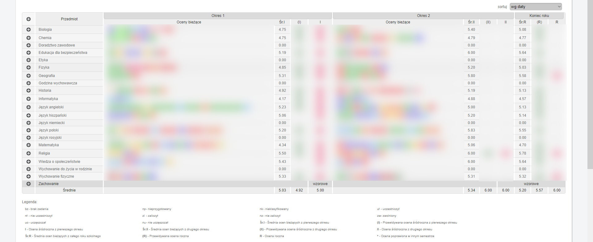

#  Librus Średnia
Rozszerzenie do najpopularniejszych przeglądarek dodające możliwość wyświetlenia średniej z ocen, która nie zaśmieca strony.

Wtyczka posiada ustawienia z możliwością konfigurowania każdej funkcji.

| Przed  | Po |
| ------------------------- | --------------------- |
|   |   |

# Funkcje w wersji 3.0.X
* Wyświetlanie średniej dla każdego przedmiotu w tabeli z ocenami.
* Wyświetlanie średniej wszystkich ocen na dole tabeli.
* Wyświetlanie średniej ocen śródrocznych i rocznych.
* Wyświetlanie średniej przewidywanych ocen śródrocznych i rocznych.
* Automatyczne zamykanie pola "Zachowanie" w tabeli.
* Możliwość zmiany parametrów wyliczania średniej w ustawieniach.
* Inteligentne dostosowywanie ilości kolumn w tabeli.
* Synchronizowanie ustawień między przeglądarkami, gdy użytkownik jest do niej zalogowany (jeśli przeglądarka wspiera synchronizację).
* Automatyczne przełączanie planu lekcji na najbliższy tydzień w weekend po otwarciu go.

# Sposób liczenia średniej
Do średniej domyślnie liczą się tylko oceny oznaczone `Licz do średniej: tak`. Pod uwagę jest brana waga. Domyślnie `+` dodaje 0.5 do wartości oceny, a `-` odejmuje 0.25. Oceny niezawierające *normalnej* liczby nie są brane pod uwagę.
Parametry liczenia można zmienić w ustawieniach wtyczki (wciskając ikonkę wtyczki).

# Zgłaszanie błędów
Wejdź w zakładkę `Issues` i utwórz nowy wątek.

# Instalacja

## [Chrome](https://chrome.google.com/webstore/detail/librus-średnia/oggojknablgjgacijcjbioanonlkmfeg)

## [Opera (Przez chrome web store)](https://chrome.google.com/webstore/detail/librus-średnia/oggojknablgjgacijcjbioanonlkmfeg)

## Firefox
Wtyczka w firefoxie **obecnie nie działa**.

## Przeglądarki oparte na chrominium
Jeśli się da to przez [chrome web store](https://chrome.google.com/webstore/detail/librus-średnia/oggojknablgjgacijcjbioanonlkmfeg)

### Instalacja ręczna
1. Sklonuj repozytorium.
2. Uruchom w konsoli polecenie `npm install` (wymagane Node.js v18 i npm (testowane na 9.8)).
3. Uruchom w konsoli polecenie `npm run dev`.
4. W Twojej przeglądarce wejdź w Rozszerzenia -> Zarządzaj rozszerzeniami.
5. Włącz tryb dewelopera.
6. Wciśnij "Załaduj rozpakowane" i wybierz folder `extensions/combined/dist/chrome`, gdzie znajduje się rozpakowana wtyczka.

# Mogę wesprzeć projekt?
Tak. Możesz pomóc go rozwijać lub możesz wesprzeć projekt finansowo. Zerknij na link po prawej stronie pod napisem `Sponsor this project`.