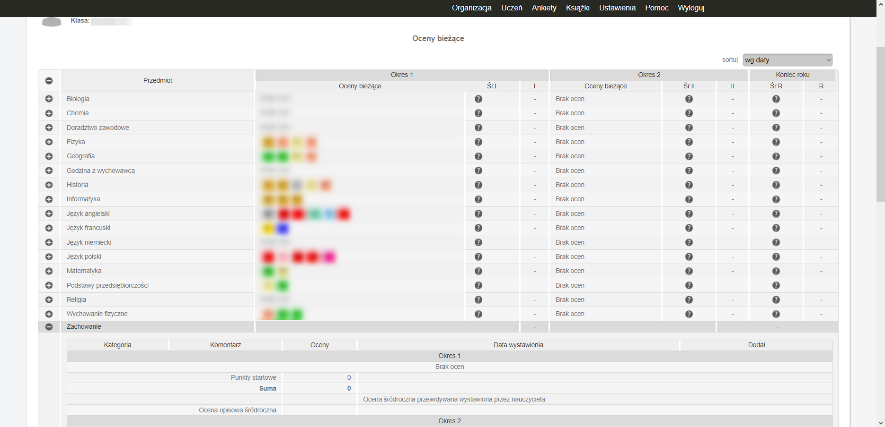
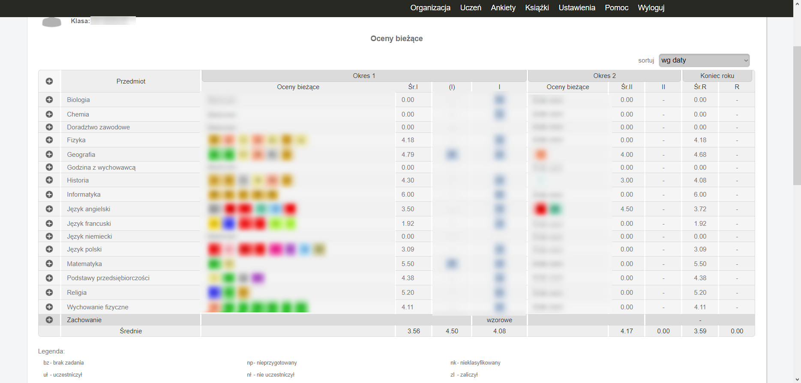

# Librus-srednia
Rozszerzenie do najpopularniejszych przeglądarek dodające możliwość wyświetlenia średniej z ocen, która nie zaśmieca strony.

| Przed  | Po |
| ------------------------- | --------------------- |
|   |   |

# Funkcje w wersji 2.0.X
* Wyświetlanie średniej dla każdego przedmiotu w tabeli z ocenami.
* Wyświetlanie średniej wszystkich ocen na dole tabeli.
* Wyświetlanie średniej ocen śródrocznych i rocznych.
* Wyświetlanie średniej przewidywanych ocen śródrocznych i rocznych.
* Automatyczne zamykanie pola "Zachowanie" w tabeli.
* Możliwość zmiany parametrów wyliczania średniej w ustawieniach.
* Inteligentne dostosowywanie ilości kolumn w tabeli.
* Synchronizowanie ustawień między przeglądarkami, gdy użytkownik jest do niej zalogowany (jeśli przeglądarka wspiera synchronizację).

# Sposób liczenia średniej
Do średniej domyślnie liczą się tylko oceny oznaczone `Licz do średniej: tak`. Pod uwagę jest brana waga. Domyślnie `+` dodaje 0.5 do wartości oceny, a `-` odejmuje 0.25. Oceny niezawierające *normalnej* liczby nie są brane pod uwagę.
Parametry liczenia można zmienić w ustawieniach wtyczki (wciskając ikonkę wtyczki).

# Zgłaszanie błędów
Wejdź w zakładkę `Issues` i utwórz nowy wątek.

# Instalacja
Code -> Download ZIP.
## Opera
1. Wejdź w Rozszerzenia -> Zarządzaj rozszerzeniami.
2. Włącz tryb programisty w prawym górnym rogu.
3. Wciśnij "Załaduj rozpakowane" i wybierz folder `extensions/combined/dist/chrome`, gdzie znajduje się rozpakowana wtyczka.

## Chrome
1. Wejdź w Rozszerzenia -> Zarządzaj rozszerzeniami.
2. Włącz tryb dewelopera w prawym górnym rogu.
3. Wciśnij "Załaduj rozpakowane" i wybierz folder `extensions/combined/dist/chrome`, gdzie znajduje się rozpakowana wtyczka.

## Firefox
Wtyczka w firefoxie **obecnie nie działa**.

## Inne przeglądarki
Na innych przeglądarkach działających na silniku Chrominium instalacja powinna być analogiczna.

# Łee a czemu nie ma tego do pobrania w sklepach z rozszerzeniami?
Bo chrome pobiera haracz, a opera wymaga zweryfikowania wtyczki i nie chce mi się przechodzić przez ten proces.

# Mogę wesprzeć projekt?
Tak. Możesz pomóc go rozwijać lub możesz wesprzeć projekt finansowo (na przykład na opłacenie chromowego haraczu). Zerknij na link po prawej stronie pod napisem `Sponsor this project`.
